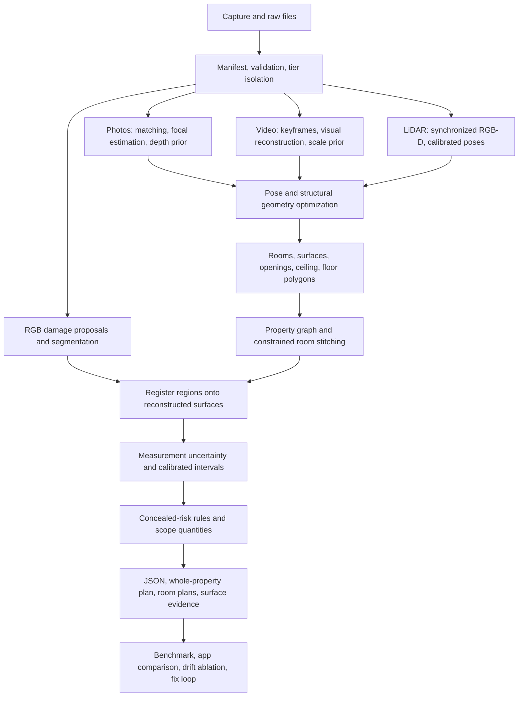

# Applied AI case study: implementation and completion plan

Prepared: 3 October 2026. Primary specification: `Applied_AI_Case_Study.pdf` (all six PDF pages reviewed; the cover is unnumbered and the body is numbered 1–5).

**Status:** planning and initial data inspection completed. Reconstruction, AI inference, accuracy evaluation, and gate compliance have not been demonstrated yet. All commands, modules, and output paths below are proposed unless explicitly identified as existing inputs. This document is the working implementation plan, not the final six-page technical report.

## 1. What we must build

Build a reproducible property assessment pipeline that accepts any of three input tiers—2–8 unposed photos per room, a handheld RGB video, or LiDAR depth with poses and intrinsics—and produces the same output contract:

- A dimensioned plan for every room, including walls, ceiling height, floor area, and openings.
- One stitched whole-property floor plan, including room placement, connections, correct adjacency, and dimensions. This is mandatory for photos too.
- Damage regions assigned to physical surfaces, with a class and metric extent.
- Concealed-damage risk flags with the explicit rule and evidence that triggered each flag.
- Scope line items referring to those same surface IDs.
- An uncertainty interval for every reported measurement.
- Schema-compliant JSON, a rendered plan, and a single command for each capture.

Choose **Route 2: a stock capture protocol**. Use the native iPhone Camera for stills/video and propose Stray Scanner for LiDAR. Its official repository describes free collection of raw RGB-D data, and the supplied exports strongly match its format. The user has now confirmed Stray Scanner 1.4; pin the adapter to that version and verify the final capture sheet on that installation. This avoids making an iOS application a dependency of the submission. [Stray Scanner](https://github.com/strayrobots/scanner)

Confirmed by the user: **Ubuntu 24, 64 GB RAM, 1 TB SSD; iPhone 15 Pro Max; Stray Scanner 1.4**. The laptop has **no GPU**; CPU model and free SSD space remain unspecified. The user authorizes Kaggle for faster development runs and plans a CPU interview demonstration, with GPU use only if the evaluator permits it. The laptop is the primary execution target. Kaggle is an optional development and training environment. No proprietary backend or paid inference API is required. Initial installation/model downloads can use the internet; a prepared live pipeline must run locally on previously unseen data.

### 1.1 How the PDF affects priorities

| PDF section | Meaning for implementation |
|---|---|
| Part 1, printed page 1 | Own capture from phone to files; all three tiers mandatory; publish hardware/accuracy matrix. |
| Part 2, printed pages 1–2 | Fulfill the entire output contract; collect the prescribed benchmark; demonstrate accuracy, calibration, repeatability, and drift correction. |
| Part 3, printed page 3 | Compare LiDAR against one consumer app on two benchmark rooms, using its real exports. |
| Part 4, printed page 3 | Declare the worst gate, predict an improvement, ship the fix, and regenerate both runs. Analysis alone earns zero here. |
| Part 5, printed page 3 | Preserve genuine incremental commit history and be able to defend decisions without tools. |
| Deliverables, printed page 4 | Deliver eight bundles, including a clean-machine setup under 15 minutes and a technical report of at most six pages. |
| Walk-in test, printed page 4 | Evaluator chooses the tier and captures an unseen property; cached benchmark results cannot substitute for live inference. |
| Scoring/constraints, printed page 5 | Walk-in 30%, fix loop 25%, benchmark 15%, compliance 10%, app comparison 10%, capture 5%, process 5%. Disclose models/data; handle mirrors, glass, glossy surfaces, and low light. |

Prioritize a complete runnable path through all tiers, measured geometry, honest uncertainty, and the fix loop before interface polish.

### 1.2 Exact gates and unresolved specification details

| Gate | PDF requirement | Planned test |
|---|---|---|
| Opening widths | Error ≤2 cm on ≥85% of openings; missed and phantom openings each count as misses | Match predictions to ground-truth openings one-to-one; count incorrect widths, missed openings, and unmatched predictions. |
| Ceiling height | Error ≤1.5 cm per room; repeated-capture spread ≤1 cm | Report signed bias, absolute error, and max–min height across independent captures. |
| Wall repeatability | Two captures at the same tier agree within 1 cm or 0.5% per wall | Report both absolute and relative differences for corresponding wall segments. |
| Drift accountability | Explicit correction plus stitched footprint with correction on/off; raw poses alone fail | Run the identical capture/configuration with only drift correction toggled. |
| Photo whole-property stitch | Correct adjacency, no room overlaps, footprint within ±8%, calibrated intervals | Evaluate topology, polygon intersections, footprint measures, and interval coverage. |
| Photo wall lengths | Within ±8%, with calibrated intervals | Relative errors and empirical interval coverage, including weak captures. |
| Video wall lengths | Within ±3%, with calibrated intervals | Same evaluation with video-only inputs. |
| Consumer comparison | Beat or tie on ≥70% of shared dimensions across two rooms | Paired errors against independently measured ground truth. |

**Missing specification (user confirms they do not have it):** the PDF refers to the full Round 1 contract, Round 1 gates, and a published JSON schema, but none is included in this workspace. Obtain these before declaring compliance. Do not invent a LiDAR wall-length threshold or damage acceptance threshold.

**Clarifications to request from the evaluator:** definition of footprint error; whether “1 cm or 0.5%” means the larger tolerance or separate tests; exact opening-score denominator; scope of height/opening gates at thinner tiers; required interval coverage level; treatment of unobservable quantities; allowed runtime/hardware; and whether an RGB-only export from a LiDAR session qualifies as the benchmark video capture. Until clarified, report the absolute and relative measures separately, use 95% intervals as our disclosed convention, and conservatively report the strict height/opening checks for every tier. Wider intervals do not excuse a failed point-accuracy gate.

## 2. What is actually present in the workspace

### 2.1 Verified inventory

Each scan has `rgb.mp4`, `odometry.csv`, `imu.csv`, `camera_matrix.csv`, `depth/`, and `confidence/`. Paths below preserve the actual capitalization and spelling.

| Dataset | Still photos | Depth maps = confidence maps = pose rows = MP4 video samples | MP4 track duration | Total source size |
|---|---:|---:|---:|---:|
| `kitchen/` (scan at `lidar/`) | 8 | 2,298 | 52.317 s | 125.2 MB |
| `three_room/` (scan at `lidar/`) | 8 + 8 + 6 | 5,351 | 123.483 s | 302.7 MB |
| `Crack_water/` (scan at `lidar/04a0d041fc/`) | 7 | 2,338 | 39.267 s | 111.8 MB |
| `single_room/c00a170fe1/` | 0 | 1,715 | 37.183 s | 88.5 MB |
| `single_scan_floor_only/1a8384c3f6/` | 0 | 5,251 | 114.783 s | 276.7 MB |
| `single_scan_with_ceiling/c7d28f72c6/` | 0 | 9,745 | 214.933 s | 508.4 MB |

Total supplied dataset size is **1,413,387,436 bytes**, approximately 1.41 GB decimal. There are 37 JPEG files, of which eight are confirmed duplicates of other supplied JPEGs.

Inspection performed:

- Enumerated all dataset files and checked all depth/confidence filename ranges: contiguous from zero, with no missing IDs; pose frame IDs agree with depth IDs.
- Read all six odometry/IMU CSV files. Pose timestamps are increasing; the largest pose interval is approximately 50 ms, with no interval over 100 ms.
- Parsed MP4 container metadata: all six are HEVC (`hvc1`), 1920×1440, with identity track rotation matrices and variable sample timing. Container sample counts agree with pose/depth counts.
- Decoded first, middle, and last depth/confidence PNGs of each scan. All sampled maps are 256×192; depth is stored as integer grayscale and confidence values range from 0 to 2. Some sampled evaluator depth maps contain zero pixels.
- Inspected all supplied stills in contact sheets, and two damage-room images at larger size. All JPEGs are 3024×4032. The inspected EXIF fields for camera model, orientation, and date are absent.
- Compared corresponding kitchen/room_1 JPEGs using SHA-256: all eight pairs are byte-identical.

**Inspection limits:** videos have not been decoded or watched end-to-end; only container metadata was inspected. PNG content was sampled, not exhaustively decoded. No 3D reconstruction, metric measurements, model predictions, or ground-truth comparison has run. Directory names do not prove physical room identity or coverage.

### 2.2 Discrepancies and what to do about them

| Finding | Evidence / certainty | Consequence | Action |
|---|---|---|---|
| Round 1/schema missing | No corresponding documents or schema files supplied | Exact output/gate compliance cannot yet be checked | Obtain official schema, Round 1 instructions, examples, and evaluator clarifications; meanwhile implement an explicitly provisional internal schema. |
| Laser ground truth supplied; repeats deferred; app exports absent | Corrected `measurements.txt` identifies kitchen, hall, and corridor with room/doorway dimensions | Sufficient for initial dimension checks; opening IDs/offsets and metric damage truth remain incomplete | Use corrected dimensions; track provisional opening associations and unscored damage extents. Handle repeat scans later as requested. |
| Multi-room set is two rooms plus connector | User confirms room_3 is the corridor; hall connects to kitchen and corridor | Does not meet the literal requirement of three rooms plus a connector | User explicitly chooses the existing kitchen–hall–corridor setup for now. Proceed with it and document this benchmark shortfall; additional room collection is outside the current scope. |
| Reused kitchen photo set | All eight kitchen images exactly equal corresponding `three_room/room_1` files | Reuse is valid for a property subset, but not independent repetition or calibration/test separation | Assign one shared scene/capture identity; collect a fresh photo set for repeatability. |
| Independent repeatability files not yet identified | User confirms repeated scans exist; their mapping to rooms/tiers is pending | Repeats may satisfy this requirement once independence and coverage are checked | Deferred at the user's request. Later locate existing repeats and map capture IDs; recapture only if insufficient. Prefer repeats at each tier. |
| Staged damage confirmed; metric extent truth absent | User confirms staged regions: black = crack, brown = water_logging/floods | Supports a staged two-class demonstration; does not validate real-defect recognition or metric extent accuracy | Preserve labels/staging provenance; infer and export region extent with uncertainty, but leave extent accuracy unscored until measured truth exists. Keep color-to-class annotations out of general inference rules. |
| Damage scan may have limited room coverage | Its camera-position span is only about 1.18×0.53×1.03 in recorded coordinates | Likely useful local evidence; full-room floor/ceiling coverage remains unverified | Inspect video and coverage map; recapture a whole-room sweep if needed. If combining with a room scan, explicitly register them and disclose the additional input. |
| Evaluator examples contain no separate photo folders | All three `single_*` exports are sensor bundles | They do not establish a genuine independent photo benchmark | Derive 2–8 RGB frames per room only for disclosed synthetic smoke tests; collect actual stills for the primary benchmark. |
| Floor-only scan may not observe ceiling | Name suggests limited coverage; video not yet reviewed | Accurate ceiling height may be unobservable | Use as missing-evidence stress test; mark inferred/unknown height and widen uncertainty, and collect ceiling coverage for benchmark compliance. |
| RGB is inside the LiDAR export | All six contain `rgb.mp4` | Useful RGB-only development input, but sensor leakage is easy | Strictly isolate video files for video-tier runs; no poses, intrinsics CSV, IMU, depth, or LiDAR caches. Also collect native-camera video for device-format coverage. |
| No still camera metadata | Camera model/orientation/date EXIF fields absent | Cannot safely reuse scan intrinsics for 3024×4032 stills or identify capture hardware | Preserve original unmodified exports if available; otherwise estimate focal length/orientation and propagate uncertainty. |
| Different intrinsics across frames/devices | User scans have focal lengths around 1340 px; evaluator scans around 1600 px; all vary within a scan | One global camera matrix creates avoidable geometric bias | Use per-frame `fx, fy, cx, cy` and each stream's true resolution; do not borrow one device's calibration for another. |
| `camera_matrix.csv` is the last frame's calibration | It matches final pose intrinsics; also documented by exporter | Treating it as fixed throughout the scan discards available calibration | Use as backwards-compatible fallback only. |
| Variable video timing | Many `stts` entries; average sample rates differ despite a 60-unit timebase | `frame_index / 60` is an incorrect time mapping | Decode presentation timestamps, check frame IDs and time alignment; account for codec reordering/edit lists before pairing. |
| IMU units likely disagree with documentation | Median acceleration-vector norms are 0.999–1.003 across all six logs | Values resemble acceleration in g, despite current format docs saying m/s²; blind conversion/integration would be wrong | Check the capture version/source and stationary segments. Treat units and gravity inclusion as unresolved. Avoid inertial translation integration initially. |
| No distortion lookup data | Distortion-center cells are blank; no `distortion/` folders | Missing optional calibration is not itself corruption; peripheral residuals may remain | Verify whether RGB is already rectified; use a suitable calibrated model or widen edge uncertainty. Never invent coefficients. |
| Reflective/occluded surfaces visible | Glossy floor, glass sliding doors, curtains, appliances/cabinets | False planes/openings; hidden wall boundaries; missing window extent | Preserve free-space/visibility evidence, combine views, mask unreliable surfaces, and label unobserved geometry. |
| PDF says evaluator provides no captures, but samples were supplied | User identifies three exports as evaluator samples | Samples are helpful, but do not remove the self-collected benchmark requirement | Treat as compatibility/stress fixtures; ask whether there are newer written instructions. |

The format match and user-confirmed Stray Scanner 1.4 support millimetre depth conversion and per-frame calibration; geometric validation remains necessary. Current exporter documentation also explains that confidence is ordinal; it is not a calibrated measurement probability. [Export format](https://raw.githubusercontent.com/strayrobots/scanner/main/docs/format.md)

### 2.3 User-confirmed layout, damage labels, and measurements

Re-read the user-corrected `measurements.txt`. The final block is now correctly labeled room_3. The user confirms laser measurements, and that the corridor ceiling and doorway are both 2.26 m high. Use the existing three-space setup as explicitly requested; no additional room capture is required to proceed.

| Block in measurements.txt | Height | Length | Breadth | Doorway height | Doorway width | Interpretation |
|---|---:|---:|---:|---:|---:|---|
| Kitchen/room_1 | 2.80 m | 2.30 m | 2.36 m | 2.26 m | 0.88 m | Kitchen confirmed. |
| Hall/room_2 | 2.80 m | 3.30 m | 4.20 m | 2.26 m | 0.88 m | Hall confirmed. |
| Corridor/room_3 | 2.26 m | 0.81 m | 1.67 m | 2.26 m | 0.81 m | Corrected room ID; ceiling and doorway height confirmed. |

Confirmed adjacency: `kitchen/room_1 ↔ hall/room_2 ↔ corridor/room_3`. No direct kitchen–corridor edge has been asserted. This is reference topology for scoring; the unassisted photo/video pipeline must infer connections from its permitted inputs.

Confirmed damage labels: black region → `crack`; brown region → `water_logging/floods`. Preserve the user's original label in annotations; map to the eventual official taxonomy explicitly. A brown flood marker is not evidence of actual moisture or concealed damage. The user confirms these are staged regions. Disclose this and evaluate generalization on realistic defect appearances separately. Do not implement a black-equals-crack/brown-equals-flood rule for unseen properties.

Measurement provenance: laser, as confirmed by the user; instrument accuracy/repeat readings are not supplied. The current file contains room-level doorway dimensions but no explicit connection annotations beyond the separately confirmed adjacency. Provisional association: the 0.88 m kitchen/hall rows describe the kitchen–hall opening, and the 0.81 m corridor row describes the hall–corridor opening. Validate against the images before treating this as verified per-opening truth, and do not count the shared kitchen–hall opening twice. Missing opening offsets/other apertures and staged-region dimensions are later evaluation gaps, not blockers to implementation. Rectangular length×breadth areas would be derived references, not independent measured areas.

**Sensor processing requires no user-side file editing or recapture at present.** Use video presentation timestamps/frame IDs, per-frame intrinsics, and version-specific IMU unit validation. Do not integrate IMU translation until units and gravity conventions are established. Ask for a new calibration capture only if validation reveals an unresolved problem.

## 3. Proposed complete pipeline



### 3.1 Common data contract and ingestion

Tasks:

1. Define immutable raw inputs and a generated manifest: property/room/capture IDs, tier, source paths, hashes, device/app metadata, timestamps, sensor presence, units, coordinate convention, and permitted modalities.
2. Discover a scan root recursively from its required files; support both direct `lidar/` and nested scan-ID folders. Preserve original files.
3. Parse whitespace in CSV headers/values; validate finite values, quaternion norms, unique frame IDs, monotonic timestamps, dimensions, and valid depth/confidence pairing.
4. Implement FFmpeg/PyAV decoding of HEVC plus common native-camera MOV/H.264/HEVC inputs. Check presentation order, timebase, rotation, color interpretation, and duplicate/missing frames. Save timestamped keyframes on demand rather than all RGB images.
5. Decode depth without normalizing it to 8-bit; mask zero/invalid values and low confidence. Store both the original confidence class and filtering decisions.
6. Produce a quality report: blur, exposure, coverage, overlap, motion gaps, depth-valid fraction, suspected reflections, and unresolved calibration.
7. Enforce modality boundaries through separate input views and cache namespaces. A photo run receives only photos; a video run receives only RGB video. Keep ground truth inaccessible to inference.
8. Retain source-to-output provenance for each measurement and mask.

Acceptance: all six existing exports load; malformed data produces an actionable error; photo/video runs remain unchanged when forbidden sensor files are removed. One bad frame must not silently corrupt the entire capture.

### 3.2 LiDAR reconstruction and drift correction

Tasks:

1. Establish the export convention: quaternion ordering, camera-to-world versus world-to-camera, axis directions, and upright/gravity direction. Verify by reprojecting known surfaces across adjacent frames. Apply the ARKit/OpenCV basis conversion only after confirming it from source and geometry.
2. Build per-frame RGB intrinsics. For aligned 1920×1440 RGB and 256×192 depth, the scale factors are both 1/7.5. Apply crop/rotation and pixel-centre conventions consistently; confirm alignment rather than blindly resizing.
3. Back-project valid depth: `X_camera = depth_m * inverse(K_depth) * [u, v, 1]`. Transform into a common property frame using the validated pose convention.
4. Select keyframes by translation, rotation, blur, new surface coverage, and doorway/loop events. Start with roughly 100–400 geometry keyframes for short captures, increasing when coverage demands it. These are tuning budgets, not hard limits.
5. Initialize local submaps from sensor poses. Refine adjacent transforms with robust point-to-plane ICP where overlap supports it.
6. Generate loop candidates from image similarity/features; geometrically verify them and reject repeated-door/corridor false matches. Optimize a pose graph with odometry, verified loops, and structural plane factors. Use robust losses and confidence weights.
7. Anchor the coordinate gauge, not the building dimensions. Gravity and observed plane alignment can constrain orientation; do not force every building into a rectangle or every wall to a right angle.
8. Reintegrate corrected poses into a voxel/TSDF representation or bounded surfel map. Use centimetre-scale storage initially, then fit measurement planes/edges from retained raw observations so voxel quantization does not define precision.
9. Save raw and corrected trajectories, accepted/rejected loops, residuals, and footprints. Include a switch that disables correction without changing other processing.

Acceptance: geometrically consistent surfaces, no mirrored axes, correct units, measurable drift diagnostics, and regenerable correction-on/off artifacts. A lack of verified loops is reported; it is not masked by forcing the trajectory closed.

### 3.3 Video-only reconstruction

Tasks:

1. Extract overlapping sharp keyframes, initially about 1–3 per second, with extra frames through doorways and turns. Retain full video timestamps; bound keyframe counts adaptively.
2. Estimate camera parameters and relative poses with COLMAP structure-from-motion; start with SIFT matching and use ALIKED/LightGlue when it improves registration. Fit camera/lens groups rather than a single arbitrary focal length for all inputs.
3. Detect pure rotation, motion blur, low parallax, insufficient overlap, and disconnected tracks. Use bundle adjustment and verified loop matches to reduce accumulated error.
4. Use pretrained metric monocular depth as an uncertain absolute-scale prior. Align reliable predicted depths to triangulated structure with a robust scale fit; enforce scale consistency across the connected property. Reject glass, sky/window views, and poorly conditioned points from the fit.
5. Reconstruct planes and room boundaries from multi-view evidence; use predicted depth as supporting evidence where reconstruction is sparse.
6. If reconstruction splits into components, attempt relocalization through shared doorway views. Preserve unresolved scale/topology uncertainty if recovery fails.
7. Run the same downstream surface, stitching, damage, and export contract as LiDAR.

**Feasibility constraint:** monocular geometry alone recovers scale only up to an unknown factor. A learned metric predictor supplies a prior, not guaranteed survey accuracy. The ±3% target must be measured on native-camera recordings. An optional known dimension can improve a separate assisted mode only if the evaluator allows it; the mandatory video mode cannot depend on LiDAR logs or ground-truth measurements.

### 3.4 Photos-only reconstruction and whole-property stitching

This path is a first-class deliverable and the largest technical risk.

Tasks:

1. Consume 2–8 images per room without pose/depth metadata. Use folder names only as room membership, never as implied adjacency or layout order.
2. Infer focal length when absent, detect verticals/vanishing directions, and obtain metric depth priors. Match images within each room, then test promising cross-room pairs, especially views through doorways.
3. Jointly estimate camera poses, structural planes, and scale with feature reprojection, depth-prior consistency, line evidence, and soft layout constraints. Do not force successful SfM when images have no useful parallax.
4. For sparse or nonmatching views, fit a room-layout hypothesis from wall/floor/ceiling boundaries and depth priors. Mark unobserved wall portions and prior-dominated measurements explicitly.
5. Detect door/window candidates. Associate potential shared doors using visual correspondences, geometry, wall normals, doorway context, and observed line of sight. Door similarity alone is weak evidence in repetitive interiors.
6. Build an adjacency graph. For each room, optimize a planar transform `(x, y, yaw)` plus uncertain scale where needed. Objective terms cover door alignment, opposite shared-wall normals, cross-room matches, compatible wall thickness, and room-interior nonintersection.
7. Solve competing graph/layout hypotheses with a bounded search followed by robust continuous refinement. Model the connector as an explicit space; allow irregular room shapes.
8. Render one best-supported property plan with every room represented. Show uncertain connections with dashed styling and record alternatives/ambiguity in JSON. Prevent geometric overlap without pretending that nonoverlap alone proves correct adjacency.
9. Evaluate at both 2-image and 8-image limits, including missing doorway overlap, absent EXIF, and repeated-looking doors.

**Information limit:** disconnected photo folders with no shared visual evidence cannot uniquely determine physical adjacency; unscaled monocular photos cannot uniquely determine metric dimensions. The pipeline can return a provisional hypothesis with honest uncertainty, but correct adjacency and ±8% footprint cannot be guaranteed for arbitrary thin input. Report these failures explicitly. The capture protocol improves observability through doorway views while still accepting arbitrary photos; supplying hidden adjacency or fixed door widths is not an acceptable workaround.

### 3.5 Shared structural geometry and property model

Tasks:

1. Fit robust floor/ceiling/wall planes using geometric support plus RGB masks. Separate furniture, cupboard fronts, beams, soffits, and curtains from structural boundaries.
2. Estimate wall intersections and interior room polygons; combine occupancy and free-space evidence with camera trajectory and opening locations to split rooms and connectors.
3. Support nonrectangular rooms. Use orthogonality only as a tested soft prior. Save residuals and evidence for any imposed constraint.
4. Measure wall segments along the declared finished-surface convention. Calculate floor area from interior polygons, and ceiling height from floor/ceiling geometry. Treat sloped ceilings and soffits explicitly; ask the schema how to represent multiple heights.
5. Detect openings from RGB semantics, depth discontinuities, plane boundaries, and observed free space. Refine jambs/lintels with multi-view edges. A closed door is not “no opening,” and missing LiDAR returns are not automatically a door/window.
6. Distinguish structural aperture, frame, and visible door-leaf widths. Ground truth and predictions must measure the same convention. Include opening position, width, height, and type as required by the official schema.
7. Assign stable `room_id`, `surface_id`, `opening_id`, and adjacency edges. Give shared walls/surfaces an explicit relationship to avoid duplicate areas and inconsistent openings.
8. Reconcile rooms in one property coordinate frame; use shared boundaries and openings as constraints. Keep camera-route order distinct from architectural adjacency.
9. Calculate interior area, footprint area, and outer boundary separately where possible. Exterior footprint depends on wall thickness; do not silently equate it to summed interior area.

Acceptance: room polygons are valid; interiors do not overlap; openings belong to valid surfaces; shared doorway geometry agrees; all dimensions have units, status, provenance, and intervals.

### 3.6 Visible damage detection and metric extent

Tasks:

1. Map the official damage taxonomy when supplied. User-provided development labels are `crack` and `water_logging/floods`; treat visible staining as one possible water-related appearance, not an automatic synonym for the flood label; preserve `unknown_surface_anomaly` rather than forcing every mark into these classes.
2. Establish held-out annotations for true cracks/stains and difficult negatives: tile joints, wires, shadows, reflections, paint variation, tape, cardboard, and furniture edges. Annotations are benchmark/development evidence, not runtime hints.
3. Prototype automatic Grounding DINO proposals with fixed prompts, followed by SAM 2.1 Tiny masks. These are general-purpose models: SAM does not classify damage, and prompt-based detection may miss fine cracks.
4. Evaluate high-resolution tiled crack processing using thin-line candidates plus a compact segmentation model if the baseline fails. Train or fine-tune only on separately licensed development data and independently annotated scenes. Do not train and test on crops from the same damage instance.
5. Localize still cameras against the reconstruction before using their masks for LiDAR measurements. Use image matching and 2D–3D pose estimation with inlier/residual checks; the stills do not inherit a video frame pose just because filenames are similar.
6. Project mask pixels onto the associated surface through calibrated rays/depth, respecting visibility and occlusion. For a planar wall, use a metric surface coordinate system and ray-plane intersections.
7. Merge overlapping observations in surface coordinates, retaining the union of damaged regions. Do not sum repeated views of the same defect.
8. Calculate stain area and dimensions; calculate crack centreline length and resolvable width, with a stated length/width definition. Retain segmentation boundary uncertainty and surface-scale uncertainty.
9. Flag sub-resolution crack widths as unresolvable; 256×192 depth cannot directly measure hairline cracks. RGB sampling, viewing distance, focus, and surface calibration determine the resolution limit.
10. Export image overlays and a per-surface elevation showing the defect and metric extent. Separate unlocalized visual detections from regions that can be measured on a known surface.

Acceptance: both classes have measured precision/recall and localization/extent errors; no class is established from the folder name. Missing damage remains a scored miss. Until independent labels exist, output quality is unvalidated.

### 3.7 Concealed-damage flags and scope line items

Use versioned deterministic rules over measured evidence. Rules indicate reasons to inspect; they do not claim to see behind a wall.

Example provisional rules, to align with the Round 1 taxonomy:

- `WATER_AT_OCCLUDED_EDGE`: a supported water-staining region reaches an occluded wall boundary; flag adjacent hidden area for inspection, with the observed stain and occlusion evidence.
- `CRACK_INTO_OCCLUSION`: an observed crack terminates at an obstruction; flag potentially hidden continuation without asserting its length.
- `INSUFFICIENT_VISIBILITY`: a surface cannot be assessed; report missing inspection coverage separately from a positive damage flag.

Each flag stores rule version, input evidence IDs, thresholds, affected surface, rationale, and inspection recommendation. Thresholds are engineering rules until validated; they are not diagnostic probabilities.

Scope generation uses an explicit action catalogue keyed to surfaces and defects. Examples include inspect a concealed region, prepare and refinish an observed damaged area, or repair a supported crack length. Include quantity, unit, interval, assumptions, evidence, and any declared waste/minimum-work factor. Union regions before totaling. Do not invent rates, jurisdiction-specific repair rules, or confirmed hidden-damage quantities. If cost is required by the missing schema, obtain the intended rate catalogue.

### 3.8 Measurement uncertainty and calibration

Every wall length, height, area, opening dimension, and damage extent gets a measurement record. A provisional internal shape is:

```json
{
  "value": 3.42,
  "unit": "m",
  "interval": {"level": 0.95, "lower": 3.35, "upper": 3.50},
  "status": "estimated",
  "method": "multi_view_plane_fit",
  "evidence_ids": ["frame_0140", "frame_0212"],
  "calibration_id": "lidar_lengths_v1"
}
```

Numbers above are illustrative, not results. Represent unsupported quantities with an explicit unobserved status and schema-compatible unknown fields; never output zero as an unknown height. If the official schema forbids such a representation, resolve it with the evaluator and count the unsupported output as noncompliant.

Tasks:

1. Track distinct error sources: depth noise and bias, camera calibration, pose drift, boundary localization, scale prior, occlusion, and ground-truth measurement uncertainty.
2. Perturb calibration/poses/masks and refit geometry using Monte Carlo or block bootstrap over views/captures. Preserve correlated scale errors: room area and multiple wall dimensions are not independent.
3. Fit bias corrections and interval scaling only on calibration scenes. If sample size supports it, use split conformal residual calibration; otherwise publish provisional empirical intervals and acknowledge small-sample limits.
4. Separate development, calibration, and evaluation by physical room/property and capture session. Shared kitchen photos, repeated captures, and neighboring frames cannot be scattered across splits as independent observations.
5. Report nominal versus empirical coverage, interval widths, signed errors, and an interval score that penalizes unnecessarily broad intervals. Break down by tier, measurement type, and coverage quality.
6. Evaluate geometry intervals conditional on a detection and end-to-end completeness separately; confidence intervals cannot conceal missed openings or missing damage.
7. Keep topology confidence and alternative room graphs separate from scalar measurement intervals. A narrow wall-length interval does not establish the correct room connection.
8. Mark out-of-distribution or prior-dominated results and widen uncertainty based on validated rules. Check actual data quality rather than forcing every LiDAR interval to be narrower than every photo interval.

Acceptance: no numeric measurement lacks an interval; calibration plots are reproducible; ground truth is never read during inference. The present small, correlated dataset is insufficient to establish strong general calibration claims.

### 3.9 Outputs and one-command interface

Proposed entry point:

```bash
python -m astra run --tier lidar --input kitchen/lidar --output runs/kitchen_lidar
python -m astra run --tier video --input kitchen/lidar/rgb.mp4 --output runs/kitchen_video
python -m astra run --tier photos --input three_room --output runs/property_photos
```

The photo adapter discovers image-bearing room folders and excludes `lidar/` entirely. A validation command should preview the selected files. A manifest can resolve ambiguity in new directory layouts; it must not inject measured dimensions or adjacency into unassisted inference.

Each output bundle:

```text
result.json                    # adapter to the evaluator's actual schema
plan.svg / plan.pdf             # readable whole-property dimensions and intervals
rooms/<room_id>.svg             # per-room plans
surfaces/<surface_id>.svg       # damage regions in surface coordinates
qa.json                        # quality, completeness, unresolved evidence
provenance.json                 # source hashes, code, config, models, timings
artifacts/                     # keyframe evidence, geometry, trajectories
```

Render a scale bar, room labels, doors/windows, ceiling heights, areas, dimension conventions, and uncertainty legend. Use compact interval annotations or keyed tables to prevent an unreadable plan. Provide a local HTML report if it improves review, after core artifacts work; a hosted website is not required.

## 4. Free models, software, hardware, and access

### 4.1 Initial model/software choices

These are bounded initial choices, not a commitment to load every model on every frame. Lock exact versions and checkpoint hashes after the first benchmark.

| Component | Initial choice | Role and limits | Access/licensing notes |
|---|---|---|---|
| Metric depth / missing focal metadata | Apple Depth Pro | Absolute-scale prior for RGB tiers; validate indoor scale bias and CPU/GPU runtime | Public code/weights under Apple's supplied license; download script; no paid API. [Repository](https://github.com/apple-aiml-research/ml-depth-pro), [license](https://github.com/apple-aiml-research/ml-depth-pro/blob/main/LICENSE). |
| Low-cost depth alternative | Depth Anything V2 Small | Relative depth/structure fallback; relative predictions alone do not establish metres | Small is Apache-2.0; larger variants have different, noncommercial terms. Any indoor metric checkpoint needs its own model-card/license check. [Official repository](https://github.com/DepthAnything/Depth-Anything-V2). |
| Feature matching | SIFT first; ALIKED + LightGlue if needed | Match room views and doorway overlaps; geometrically reject false matches | LightGlue code/weights Apache-2.0; ALIKED BSD-3-Clause per repository; SuperPoint has separate restrictions and is not the default. [Official repository](https://github.com/cvg/LightGlue). |
| Structure from motion | COLMAP | Camera estimation and bundle adjustment for RGB-only paths; does not solve metric scale by itself | Public local software. [Official repository](https://github.com/colmap/colmap). |
| RGB proposals | Grounding DINO Swin-T | Automatic opening/object/damage candidate boxes; damage performance is unproven | Public local model; CPU mode documented; pin checkpoint and retain applicable notices. [Official repository](https://github.com/IDEA-Research/GroundingDINO). |
| Segmentation | SAM 2.1 Tiny | Refine automatically proposed regions; not a damage classifier | Checkpoints and core code Apache-2.0; optional kernels/dependencies checked separately. [Official repository](https://github.com/facebookresearch/sam2). |
| Fine-crack fallback | Compact U-Net-style segmenter | Conditional development task if general models fail; tile full-resolution RGB | Train locally/Kaggle with documented data rights; checkpoint not yet selected; do not promise an unverified pretrained damage model. |
| Geometry and optimization | Open3D + SciPy; Shapely for polygons | ICP, planes, pose graphs, fusion, topology checks | Local processing; no model API. [Open3D](https://github.com/isl-org/Open3D). |
| Decode, validation, reporting | FFmpeg/PyAV, OpenCV, Pydantic/JSON Schema, NumPy, Matplotlib/SVG | Ingestion and reproducibility | Pin compatible builds, including HEVC support. |

Model selection gates: actual validation accuracy, artifact reproducibility, installation success, acceptable latency/memory on target hardware, and usable license. If a candidate fails, switch only that module behind its interface and record the experiment.

No foundation model training from scratch is planned. A language model is not required to generate measurements, rules, scope quantities, or the report.

### 4.2 Laptop and Kaggle execution

The confirmed Ubuntu 24 laptop has 64 GB system RAM and a 1 TB SSD. The user confirms there is no GPU. RAM/storage capacity is suitable for bounded processing, but CPU speed and available disk space remain to be profiled. Those details and runtime benchmarks are needed before promising performance. Ubuntu 24 CPU execution is the primary defense target; GPU acceleration is an additional profile.

- **CPU-only laptop:** geometry, matching, rendering, and local model fallbacks can be attempted; learned inference and RGB reconstruction may be slow. Test early, then reduce keyframes, use smaller models, or export supported models to optimized runtimes. A fast reduced mode must still be evaluated for accuracy.
- **Kaggle GPU profile:** run models sequentially, batch size one, and mixed precision where supported. An 8–16 GB VRAM budget is an initial profiling target, not a verified minimum. Do not keep all models resident.
- **Kaggle (authorized by user):** account username `subram`; credentials are reported at `~/.kaggle/access token`. Credential contents and authentication have not been inspected or validated. Read the token only when needed for an authenticated operation, without printing it or copying it into code/notebooks. Use private data/artifacts for property captures. Provide a notebook for the same package/configuration, optional segmentation training, and offline experiments. Use the free accelerator currently available to the account; checkpoint intermediate outputs and return a hashed artifact bundle. Quotas and availability vary. [Kaggle notebook documentation](https://www.kaggle.com/docs/notebooks), [GPU usage](https://www.kaggle.com/docs/efficient-gpu-usage).
- **Live defense:** predownload weights and dependencies. Demonstrate the live local path without a proprietary service. If only Kaggle meets latency requirements, resolve evaluator permission and reliable compute access before treating that as the defense plan.

Memory/storage design:

1. Stream video and depth; retain selected keyframes and compact geometry.
2. The longest video alone would occupy about 80.8 GB decimal as uncompressed 1920×1440 RGB frames. Never decode the entire dataset into RAM.
3. Set bounded geometry caches and model memory budgets; record peak RSS/VRAM per run. Start with a target under 32 GB host RAM to leave headroom, then profile.
4. Reserve approximately 30–50 GB free SSD space as a planning allowance for weights, environments, caches, and before/after artifacts; refine after packaging.
5. Cache by input hash, tier, preprocessing version, model/checkpoint, configuration, and code revision. Never reuse LiDAR-derived geometry in a photo cache.

### 4.3 What keys/access are needed

| Item | Needed now? | Details |
|---|---|---|
| OpenAI/Anthropic/Gemini or other paid model API | **No** | Entire proposed inference path is local. |
| Hugging Face token | **Not expected** | Prefer public ungated downloads; if a chosen weight becomes gated, choose an ungated alternative where possible. |
| Kaggle account | **Authorized for faster runs** | User supplied account/location of credential; authentication and accelerator availability still need validation. CPU defense path remains required. |
| Kaggle API credential | **Location provided** | Use locally for authorized automation when needed; do not expose contents. No further model API key requested. |
| Apple developer account | **No for Route 2** | Install stock apps through the normal App Store. |
| Consumer app account | **Likely for comparison** | User operates it on the phone; no API integration required. |
| Internet | **For setup/downloads** | Prepare an offline volume/cache for repeat runs and defense. |

## 5. Capture and ground-truth collection plan

### 5.1 Draft stock-capture sheet to validate and reduce to one page

This is the proposed operating content. Exact app screens, version, export steps, and time limits must be verified on the actual phone and then tested by a non-engineer following only the final sheet.

1. **Prepare:** use an iPhone 15 or newer; use a LiDAR-capable Pro/Pro Max for the LiDAR tier. Record model, iOS version, capture app/version, property ID, and room IDs. Turn on normal room lighting, clean the lens, and keep furniture/damage unchanged between benchmark captures.
2. **Photos:** native Camera, normal still mode, consistent lens/zoom, no panorama or portrait-mode processing. Take 6–8 recommended images per room while accepting the required minimum of two. Include overlapping views from different positions, floor-wall and wall-ceiling junctions, each opening, and views through shared doorways in both directions. Include close-up and contextual damage evidence within the 8-image contract for the primary run. Extra annotation photos must stay outside primary inference unless allowed.
3. **Connector:** photograph the corridor/connector explicitly and the entrances from both sides. Room folders identify spaces, not traversal order. A connector folder is evidence of an actual space.
4. **Video:** native Camera, ordinary video mode, target 1080p/30 fps for the protocol, fixed lens/zoom, no cinematic mode. Walk slowly around each room with sideways translation; avoid only spinning in place. Sweep floor, walls, ceiling, and openings; pass continuously through doors and return to an earlier view. Initial guidance: 45–90 seconds per room and 3–5 minutes for a small multi-room property, adjusted after a pilot.
5. **LiDAR:** install Stray Scanner, confirm depth recording on the supported device, and record a continuous room-to-room sweep. Keep useful wall distance, revisit the starting area, and pause briefly at opening boundaries and ceiling transitions. Export the complete raw scan, not just a mesh or screenshots. Exact menu/button instructions come from the tested app version.
6. **Real surfaces:** capture glass and glossy surfaces from multiple oblique views. Move curtains aside only when practical and record the condition; preserve hard cases for evaluation. Avoid people crossing, abrupt turns, lens changes, and moving furniture during a scan.
7. **Transfer:** export original files through Files/AirDrop/USB or another lossless route. Preserve filenames, directory structure, and metadata. Do not send originals through an image-compressing messenger. Run intake validation before leaving the property.
8. **Repeat:** stop and start a genuinely new session, change the start position/path while leaving the room unchanged, and capture again. Copying files or running inference twice is not capture repeatability.

Initial device matrix (capture compatibility is distinct from achieved measurement accuracy):

| Capture hardware | Photos | Video | LiDAR | Accuracy status |
|---|---|---|---|---|
| User's iPhone 15 Pro Max, Stray Scanner 1.4 | Supported input; actual still files inspected | HEVC export metadata inspected; full decode pending | Raw scan format inspected | All measurement gates untested; no claimed achieved accuracy. |
| iPhone 15 / 15 Plus | Required native-camera path | Required native-camera path | No LiDAR tier on these models | ±8% photo / ±3% video wall targets; empirical performance pending. |
| Evaluator's newer iPhone | Required native-camera path | Required native-camera path | Only if the actual model has LiDAR and the stock app is compatible | Test exact model/app/codec during capture rehearsal; do not imply every newer model is LiDAR-capable. |

Final device matrix entries must contain empirical wall/opening/height errors, interval coverage, tested iOS/app versions, and actual runtime profile. Strict opening/height gates and the missing Round 1 LiDAR gates remain separate from the photo/video wall targets. “iPhone 15 or newer” does not imply LiDAR on every model.

### 5.2 Required benchmark additions

| Priority | Collection | Purpose |
|---|---|---|
| P0 | Official Round 1/schema and deadline | Resolve output semantics and work sequencing. |
| P0 | Import the existing kitchen/three-room measurements, then fill missing opening/height/damage fields | Enables first accuracy and bias checks without duplicating collection. |
| Outside current scope | Additional actual room or evaluator exception | User requests current kitchen–hall–corridor setup; retain the literal benchmark shortfall in reporting. |
| P0 | Clear labeled crack and water-stain examples in one furnished room, with metric extents | Satisfies two-class damage benchmark. |
| P0 | Same rooms at all three tiers, including native RGB video and independent stills | Satisfies tier comparability and phone-format coverage. |
| Deferred by user | Locate and validate existing repeated scans later | Repeatability remains mandatory for final compliance; no immediate repeat-scan request. |
| P0 | Two rooms scanned with the chosen comparison app; preserve version and exports | Makes head-to-head scoreable. |
| P1 | Additional independent rooms/properties for calibration and untouched evaluation | Supports honest uncertainty calibration and generalization. |
| P1 | Mirror/glass, glossy floor, low light, occlusion, and weak-overlap cases | Tests known failure modes; no cherry-picking. |

Ground-truth table fields:

`property_id, room_id, surface_id, feature_id, quantity_type, measurement_definition, value, unit, instrument, instrument_resolution_or_accuracy, repeat_readings, measurer, timestamp, evidence_path`.

Measure every wall segment, floor-plan diagonals/corners needed for irregular shapes, opening widths/heights/offsets, connector dimensions, ceiling height at several locations, and defect boundaries/lengths. Record connectivity and draw a labeled reference sketch. For stain area, use a measured outline or rectified annotated surface with documented scale; bounding-box area is not the same as damaged area. Log ground-truth uncertainty and distinguish finished-wall heights from soffits.

Ground truth is used by evaluation, never quietly passed into the unassisted reconstruction. Assisted-scale experiments, if approved, are separate runs with declared extra inputs.

## 6. Work breakdown, dependencies, and completion criteria

The units below are implementation milestones. Each produces a reviewable artifact and an incremental commit in a writable repository. Keep experiment failures and limitations in the history; do not backfill fabricated progress.

| ID | Tasks and subtasks | Depends on | Completion evidence |
|---|---|---|---|
| M0 | Obtain missing spec; map every requirement; choose capture route; register assumptions; confirm hardware/deadline | User/evaluator details | `docs/compliance.md`, `docs/decisions.md`, provisional schema with unresolved fields listed. |
| M1 | Package project; pin dependencies; implement scan/photo/video discovery; validate timestamps/calibration; create immutable manifests and tier boundaries | M0 can proceed provisionally | Six scan intake reports, HEVC decode smoke test, hashes, meaningful adapter tests. |
| M2 | LiDAR single-room projection; frame conventions; quality masks; planes; floor polygon; heights/openings; initial JSON and plan | M1 | Kitchen and evaluator single-room end-to-end bundles; first raw errors when truth arrives. |
| M3 | Multi-room submaps; relocalization; loop verification; pose graph; room segmentation; shared opening constraints; on/off ablation | M2 | Stitched LiDAR property plan and trajectory/footprint ablation. |
| M4 | Video keyframes; SfM; metric-depth scale; bundle adjustment; room graph; same export contract | M1, shared geometry from M2 | RGB-only single/multi-room runs, native-camera decode test, ±3% results reported. |
| M5 | Photo intrinsics/depth; within/cross-room matching; layout hypotheses; constrained stitching; sparse-input fallbacks | M1, shared geometry | 2–8-photo tests, whole-property plan, adjacency/overlap/footprint results. Start feasibility spike during M2 rather than waiting for M4. |
| M6 | Defect taxonomy/annotations; detector/segmenter baseline; high-resolution crack fallback; camera registration; metric surface union | M1; geometry for projection | Two-class overlays, extent errors, negative-case metrics, inference with no manual prompts. |
| M7 | Versioned concealed-risk rules; action catalogue; surface-linked scope quantities; consistent JSON/rendering | M2, M6 | Traceable flags and deduplicated scope table with intervals. |
| M8 | Error model; block resampling; independent calibration splits; interval scaling; topology confidence | Starts with M2, finalizes after M3–M7 | Coverage/width/interval-score plots and measurement completeness report. |
| M9 | Collect/curate ground truth; repeats; app exports; all-tier benchmark; timing/memory; condition breakdowns | Collection starts M0; evaluation after runnable tiers | Regenerable benchmark CSVs/tables; bias versus repeatability diagnosis. |
| M10 | Freeze worst gate; one-page prediction declaration; implement fix; rerun same before/after data; regression suite | M9 baseline | Before/after revisions, commands, readable code/result diff, measured delta/post-mortem. |
| M11 | Freeze schema adapter; clean-machine setup; offline weights volume; cache replay and live paths; reports; blind capture rehearsal | M0 spec, M3–M10 | Eight deliverables complete; clean setup timed under 15 minutes; unseen capture at each tier. |

### 6.1 Dependency-driven execution order

1. Begin M0/M1, import the existing measurements (repeat scans deferred by user), and identify any remaining physical benchmark collection immediately.
2. Build M2 as the shared geometric foundation, while testing photo scale/doorway stitching early enough to expose feasibility issues.
3. Extend to M3 and establish drift correction before claiming a multi-room baseline.
4. Complete M4/M5 through the same output interface. Start M6 as soon as labeled evidence is available.
5. Integrate M7/M8 and evaluate M9 with frozen inputs/configs.
6. Reserve explicit time for M10; it carries 25% of the score and requires a shipped change.
7. Package and rehearse M11 with time to fix installation/live-run failures.

Full-scope effort estimate for one engineer: approximately **4–6 focused weeks**, with data collection and schema clarification on the critical path. This is a planning estimate, not a delivery promise. Week 1: intake, capture/truth, LiDAR baseline and photo feasibility; week 2: drift/multi-room and video; week 3: photo stitching and damage; week 4: calibration, benchmark and app comparison; weeks 5–6: fix loop, generalization, packaging, and defense rehearsal. This estimate does **not** fit the confirmed deadline of **October 4, 2026 at 00:00 IST** (the end of October 3). An accelerated schedule cannot honestly guarantee the full research/validation workload. Use the emergency priorities below while preserving a truthful account of incomplete gates.

### 6.2 Deadline-driven execution plan

**Confirmed submission deadline: October 4, 2026 at 00:00 IST (UTC+05:30), equivalent to October 3 at 18:30 UTC.** The user clarified that this means the end of October 3. Plan against the remaining hours tonight; no extension is assumed.

For tonight's deadline, use these priorities as a triage plan, not a promise of full compliance:

1. **Immediately:** import the corrected laser dimensions from `measurements.txt`; defer repeat scans as requested. Ask the evaluator for the missing schema/Round 1 material. Profile the actual CPU/GPU and verify HEVC decoding.
2. **First runnable milestone:** validated ingestion, LiDAR kitchen geometry, measured dimensions, intervals labeled provisional, JSON internal schema, and a rendered plan. Save a real baseline before tuning.
3. **Next:** multi-room reconstruction and actual drift correction/ablation, opening detection, repeat evaluation when the user returns to it, and the consumer-app capture/export work by the user.
4. **Then:** complete the simplest working photo and video paths through the shared output contract, prioritizing property stitching. Document failed registrations or scale gates; these tiers remain mandatory even if unfinished at the deadline.
5. **In the remaining implementation window:** automatic damage localization/extent, rule-based flags/scope, one real baseline-driven fix and before/after reproduction, plus packaging and measured reporting. Surface-projection work can reuse the same geometric representation.
6. **Reserve the final portion of the available time:** run reproduction commands, validate outputs, write the compliance matrix, package data/weights instructions, and produce the report. Avoid last-minute unvalidated model replacements.

For such a short window, defer custom iOS development, hosted UI, training a new damage model, large-model comparisons, dense photorealistic reconstruction, and broad platform support. Use existing pretrained weights and the user's existing measurements/repeats. Missing calibration scenes, ambiguous topology, or unmet accuracy gates must remain visibly incomplete; they cannot be solved by inventing results or narrower intervals.

At the submission cutoff, package genuinely completed work and mark unfinished requirements explicitly. The full work breakdown above remains the path to complete the intended product if additional time becomes available.

### 6.3 Proposed repository structure

```text
astra/
  cli.py
  io/                 # discovery, manifests, video decoding, tier isolation
  geometry/           # calibration, poses, fusion, planes, room polygons
  tiers/              # lidar, video, photos
  stitching/          # openings, room graph, property optimization
  damage/             # proposals, masks, localization, metric extent
  uncertainty/        # propagation, calibration, interval records
  scope/              # concealed flags, rules, quantities
  export/             # schema adapter, JSON, SVG/PDF, evidence report
configs/
schemas/
models/manifest.json  # model names, licenses, revisions, hashes, download URLs
scripts/              # setup, fetch weights, benchmark, reproduce
notebooks/kaggle.ipynb
benchmarks/           # manifests and ground truth; no inference access
reports/              # generated results and comparisons
fix_loop/             # declaration, before/after manifests, result diff
tests/
docs/
```

Keep original data outside ordinary source commits; reference files through content hashes and a supplied data volume/archive. Use an actual writable development checkout for incremental history if the workspace's `.git` is environment-protected. The plan does not claim commits were created in this inspection session.

## 7. Evaluation, app comparison, and fix-loop design

### 7.1 Evaluation protocol

- Freeze room/feature IDs, matching rules, measurement conventions, and dataset splits before final scoring.
- Treat supplied evaluator scans as compatibility/stress fixtures unless their room identity/truth is provided. Do not report their filename as ground truth.
- Measure wall/height/opening errors in centimetres and percentages, floor/footprint errors, adjacency precision/recall and graph correctness, overlaps, damage class/localization/extent, interval coverage/width, and output completeness.
- Run every required tier on corresponding rooms. Report capture-level and room-level tables rather than pooling thousands of near-identical frames as independent evidence.
- Opening provisional score: count correct matched openings with width error ≤2 cm; divide by `N_ground_truth + N_unmatched_predictions`. Missing and wrong-width openings already fail in the ground-truth denominator. Publish TP/FP/FN counts and replace this formula if the official scorer specifies another.
- For footprint, report area error, boundary distances, extents, and polygon IoU until the evaluator defines the ±8% measure. Only use rigid alignment when comparing metric outputs; rescaling a prediction to ground truth would hide scale failure.
- Repeatability: report per-wall absolute and relative deltas, height spread, and signed error against truth. Separate “stable but biased” from “unstable.” Running twice on identical files only tests deterministic reproduction.
- Preserve failures, missing outputs, and quality refusals in the denominator or a separate completeness total. Never filter them out to improve average accuracy.
- Report capture, transfer, preprocessing, inference, geometry, export, and total wall-clock time, plus cold/warm cache status and peak memory.

### 7.2 Consumer app head-to-head

Proposed app: **magicplan**, on the same two benchmark rooms, with device, installed version, capture date, export format, and any manual edits recorded. Its current official Starter Plan describes two free projects with export features, making it a practical no-paid-plan candidate. Verify export access on the actual account before scheduling collection. [Starter Plan](https://help.magicplan.app/using-magicplan-for-free), [export instructions](https://help.magicplan.app/export-your-projects).

Procedure:

1. Choose two rooms before inspecting app performance; include the furnished kitchen if fully measured.
2. Capture each with our LiDAR protocol and magicplan under comparable conditions. Preserve the raw app exports and default generated values; separately disclose any edits.
3. Compare each shared dimension with the same independently measured reference. Do not feed tape dimensions into one system and leave the other unassisted.
4. Produce `room, feature, ground_truth, our_value, app_value, our_error, app_error, beat_or_tie` plus both systems' missing dimensions.
5. Calculate the ≥70% gate over declared shared dimensions. Report dimension coverage too so neither system benefits from silently omitting difficult openings/heights.
6. State rounding/tie rules and ground-truth uncertainty. Keep any assisted/manual results separate.

### 7.3 Fix loop

Do not choose the fix based on convenience before seeing the baseline.

1. Freeze a complete baseline revision, configuration, model hashes, raw-data hashes, and evaluator script.
2. Identify the single worst-performing gate, its actual failing number, and the relevant examples.
3. Write a one-page declaration containing root-cause hypothesis, evidence, proposed change, predicted after-fix number, and the criterion for success.
4. Ship a targeted change. Candidate causes suggested by this audit include per-frame calibration misuse, edge localization bias, drift, or false damage classification; these are hypotheses, not established baseline failures.
5. Rerun the before/after on the same data and metric definitions, then check untouched scenes and remaining gates for regressions.
6. Export a readable code/config diff, side-by-side plans, numeric deltas, runtime changes, and an honest post-mortem if prediction or gate attainment falls short.
7. Supply separate reproducible commands for before and after. Keep the historical baseline real and recoverable; do not manufacture an intentionally broken baseline to inflate improvement.

## 8. Verification and release gates

### 8.1 Meaningful tests

- Synthetic plane/camera fixtures: metre/mm scale, quaternion order, transform inversion, projection after resize/rotation, and floor/ceiling sign.
- Video/depth pairing fixtures: variable timestamps, dropped frames, duplicated frames, HEVC decoding, and presentation ordering.
- Tier-isolation tests: deny access to depth/poses/IMU/truth in photo/video runs; cache keys must differ by modality.
- Geometry fixtures: irregular rooms, shared doors, false loops in similar corridors, no room-interior overlap, and valid polygon areas.
- Opening evaluation fixtures: correct width, wrong width, missed door, phantom window, and one-to-one matching.
- Damage fixtures: mask-to-plane area, crack length, multi-view deduplication, occlusion, unknown scale, and negative classes.
- Calibration checks: scene-level split integrity, finite intervals, unknown handling, correlated area uncertainty, and no label leakage.
- One-command integration runs for each tier; schema validation, evidence links, deterministic cached replay, and live uncached inference.

Use small synthetic fixtures for correctness and real captures for accuracy; a plausible-looking reconstruction is not an accuracy test.

### 8.2 Release checklist

- [ ] Official schema and Round 1 requirements mapped; all uncertainties resolved or explicitly reported.
- [ ] Required three-room-plus-connector benchmark, furnished two-class damage room, same rooms across tiers, repeats, and truth are present.
- [ ] Single-room and stitched property plans generated at all three tiers.
- [ ] Every metric output carries an interval; uncertainty calibration and completeness are reported.
- [ ] Damage masks, concealed-risk rule evidence, and surface-linked scope items exported.
- [ ] Drift correction and correction-on/off ablation regenerated.
- [ ] Two-room app comparison and ≥70% result calculated honestly.
- [ ] Fix declaration plus shipped regenerable before/after bundle complete.
- [ ] Fresh-machine setup timed under 15 minutes; preloaded weights/volume assumption documented and download time reported separately.
- [ ] Local live inference works on unseen captures at all tiers; no benchmark-specific coordinates/room order/measurements embedded in code.
- [ ] Model/data licenses, versions, hashes, environment, seeds, and runtime recorded.
- [ ] Final report fits six pages, and incremental repository history is preserved.

## 9. Deliverable-to-artifact map

All paths in this table are planned artifacts; none is marked complete merely because this plan exists.

| Required deliverable | Planned path / artifact | Current status |
|---|---|---|
| Compliance matrix | `docs/compliance.md`: requirement → implementation path → evidence → status | Pending official Round 1/schema; mapping outlined here. |
| Capture route and device matrix | `docs/capture_protocol.pdf`, `docs/device_matrix.md` | Phone/app confirmed; exact protocol trial and measured accuracy pending. |
| Repo and clean setup README | `README.md`, lockfile, setup script, CLI | Not implemented. |
| Reproduction bundle | `reproduction/manifest.json`, scripts, weights/data volume instructions | Not implemented. |
| Benchmark report | `reports/benchmark.md`, raw metric CSVs, calibration figures, timing | Corrected laser dimensions inspected; fine-grained opening/damage truth incomplete; inference pending. |
| Fix loop bundle | `fix_loop/declaration.pdf`, before/after manifests and diff | Requires genuine baseline. |
| Technical report ≤6 pages | `reports/technical_report.pdf` | Planned after measured results. |
| Raw benchmark data | Existing sources plus manifests, independent recaptures, truth, app exports | Partially present; gaps listed above. |

Suggested six-page report allocation: 1 architecture/capture/device matrix; 2 tier design and photo stitching; 3 drift and error budget; 4 benchmark/calibration/repeatability; 5 app comparison and fix loop; 6 limitations, reproduction, and defense behavior. Put detailed raw tables in the reproduction bundle, with clear references.

## 10. What I need from you

### Current scope is confirmed; no further clarification blocks implementation

- Use the existing **kitchen/room_1, hall/room_2, corridor/room_3** setup, with hall connected to both other spaces.
- Use the corrected `measurements.txt` as laser-measured reference dimensions. Corridor ceiling and doorway height are both **2.26 m**.
- Treat black and brown as **staged damage regions**, labeled crack and water_logging/floods respectively. Disclose staging and avoid inferring real concealed damage from a marker alone.
- Preserve reference dimensions/topology for evaluation. An unassisted prediction must not consume them as hidden geometric constraints.
- Current doorway associations are provisional as described in section 2.3; validate from imagery and avoid double-counting a shared opening.
- Damage metric truth, detailed opening offsets, and laser instrument accuracy can be supplied later if available. Without them, corresponding accuracy claims remain unverified.
- Repeat scans remain deferred. No extra room, repeat capture, or sensor-file editing is requested now.

### Needed for full submission compliance; not prerequisites for initial implementation

- **Benchmark composition:** current user-authorized scope is kitchen + hall + corridor. Report the difference from the PDF's three-rooms-plus-connector requirement; additional room collection is deferred outside current scope.
- **Consumer-app exports:** two benchmark rooms, app/version, exported dimensions/plans, and disclosure of any manual corrections.
- **Official Round 1/schema:** user does not have them; request from the evaluator. Use a clearly provisional schema meanwhile.
- **Defense hardware/runtime:** CPU is the baseline; GPU is conditional on evaluator permission. Deadline is confirmed as October 4, 2026 at 00:00 IST.

### Confirmed or deliberately deferred

- Ubuntu 24, 64 GB RAM, 1 TB SSD, **no GPU**. CPU model/free disk can be profiled on the actual target machine rather than blocking on a manual response.
- iPhone 15 Pro Max, Stray Scanner 1.4; iOS version is useful for the device matrix when convenient.
- Hall connects to kitchen and corridor; black denotes crack, brown denotes water_logging/floods.
- Kaggle usage is authorized; account and credential location supplied. No paid model API key needed; authentication has not yet been tested.
- **Repeat scans are deferred at the user's request.** They remain a required later evaluation task; no immediate recapture request.
- **No user-side action on video timing, changing intrinsics, or IMU units is needed now.** Preserve the raw exports; software validation handles them.

Work on ingestion, geometry, calibration validation, CPU profiling, and provisional outputs can proceed using the confirmed scope. Measurements and declared topology are evaluation evidence, not hidden inputs to an unassisted live run.
