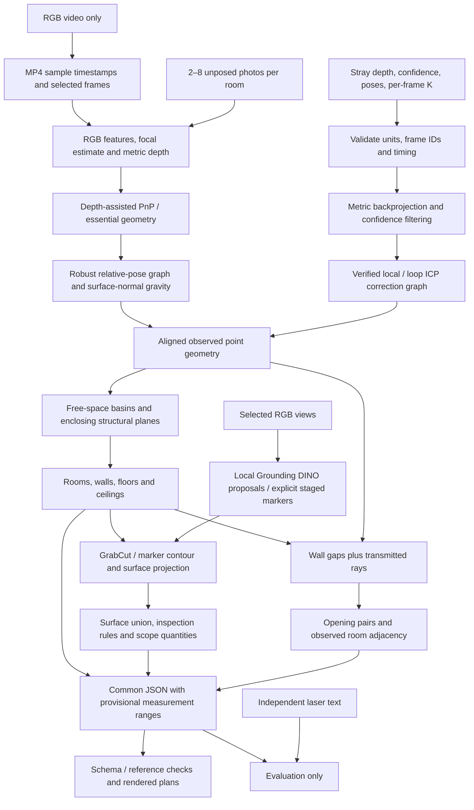

# Architecture and inference boundaries

## Coordinate and timing contract

Depth PNG values are interpreted as millimetres; output coordinates are metres. Camera intrinsics are scaled from RGB resolution to depth resolution per frame. Camera-to-world poses use xyzw quaternions and OpenCV camera coordinates, with world y up. The horizontal plan uses world x,z after a shared Manhattan-axis yaw alignment. These are Stray adapter assumptions verified on supplied exports, not universal device conventions.

The MP4 sample table supplies variable timestamps. Decoding disables presentation edit-list trimming so all recorded sensor sample indices, including the last HEVC sample, remain available. Per-frame odometry timestamps are compared with relative presentation times. No constant-FPS frame-number multiplication is used. A timing residual over 75 ms is exposed as a warning. The IMU's acceleration norm is near one; translation is not integrated under an assumed m/s² unit.

## Drift correction

Voxel-reduced nearby clouds form trimmed ICP constraints. A candidate needs overlap >30%, residual <6 cm, translation <20 cm and rotation <0.1 rad to be accepted. Nonlocal camera revisits additionally require spatial and viewing-direction agreement. A sparse robust least-squares graph estimates small world-frame rotation/translation corrections, anchored at the first frame, with smoothness and zero-correction priors. All accepted factors, residuals and maximum corrections are exported. This is a small-angle approximation, not full nonlinear SLAM or a guarantee of improved accuracy.

The drift ablation reprocesses identical frame IDs with correction off and on. The plotted footprint and numerical area changes show the actual effect. No repeatability claim is made from this replay.

## RGB reconstruction

The small initial depth model is Depth Anything V2 Metric Hypersim Small. The optional full-precision Depth Pro model estimates focal length and depth jointly. Both are learned priors, not surveyed metric truth. A CPU dynamic-int8 experiment altered focal/depth predictions substantially without useful speed benefit and is excluded from the reported benchmark configuration.

SIFT matches with ratio filtering support depth-assisted PnP; unstable pairs fall back to an essential-matrix estimate with a depth-derived scale. Connected poses are refined with robust relative factors. Surface normals provide an approximate gravity alignment assuming roughly upright views. No LiDAR depth, camera poses, IMU or laser dimensions are read by the photo/video adapter.

The maximum-support component is selected per photo folder. Independent components are explicitly displayed schematically; they cannot satisfy the physical whole-property stitch gate. Room overlap and connectivity checks run on the final output. Input overlap, repeated textures, learned scale and incorrect gravity can all defeat the pose graph.

## Geometry and semantics

This implementation uses filtered point fusion, not the planned TSDF mesher. Room candidates arise from a free-space distance watershed. Supported enclosing planes above typical furniture height replace a basin with a rectangle when plausible. Nonrectangular basins remain possible. Room-local horizontal modes estimate floor and ceiling; unobserved ceiling is null. There is no fixed room count or reference-dimension snapping.

LiDAR doorway proposals require both low wall occupancy and observed transmitted rays, with a supported lintel. Paired facing openings support adjacency. Visual opening proposals remain unverified and may include missed/phantom objects. Their widths have not passed the 2 cm gate.

Grounding DINO supplies open-vocabulary candidates. GrabCut supplies masks instead of the initially planned SAM model. Masks are projected to inferred wall planes, clipped and unioned on each surface. Projection can be biased by an incorrect wall, occlusion, depth scale or pose. Staged marker mode uses user-declared black/brown props and does not claim natural damage recognition. The current metric mask implementation associates wall regions; generalized floor/ceiling damage association is incomplete.

Concealed-damage flags are transparent inspection rules on visible evidence; they are not claims of hidden damage. Scope items are surface-keyed inspection quantities, not automated repair diagnoses or priced estimates.

## Uncertainty and calibration

Every exported measurement uses a value, unit, nominal 95% interval, method and status. Unknown quantities use null, not zero. Current intervals are explicit engineering ranges and are marked `provisional_not_empirically_calibrated`. Per-point sensor confidence and detector scores are not treated as calibrated metric confidence. This does **not** satisfy the calibrated-interval gate.

A defensible calibration step needs independent rooms/captures split by physical property, each with complete measurement correspondence and reference uncertainty. Fit residual coverage on calibration scenes, freeze the method and evaluate coverage and sharpness on held-out scenes. The supplied duplicated kitchen photos and correlated tiers must not be split as independent observations. No interval expansion based on these test labels is presented as calibration.

## Reproduction and output validation

Source hashes, model fingerprints, input hashes, dependency versions, configuration, runtime and peak RSS accompany each output. Cached depth/detector results are keyed by image content and model settings and retain a live inference path. The clean installation time and unseen-capture performance remain unverified. Provisional schema validation checks structure, measurement interval ordering and surface references; it cannot certify conformance to the absent official schema or measurement accuracy.
